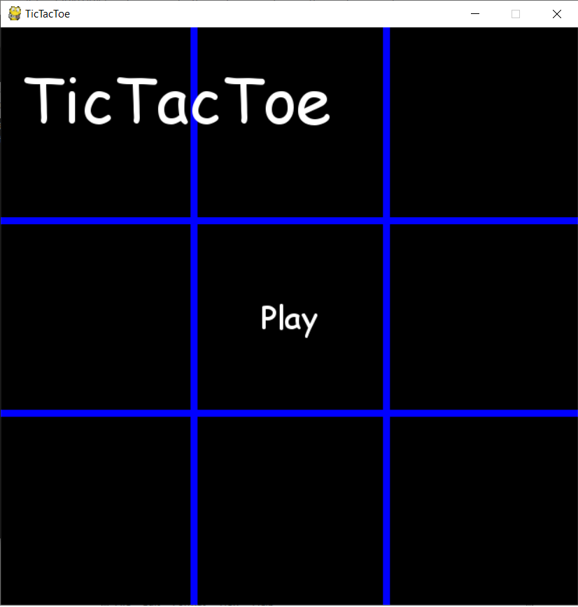
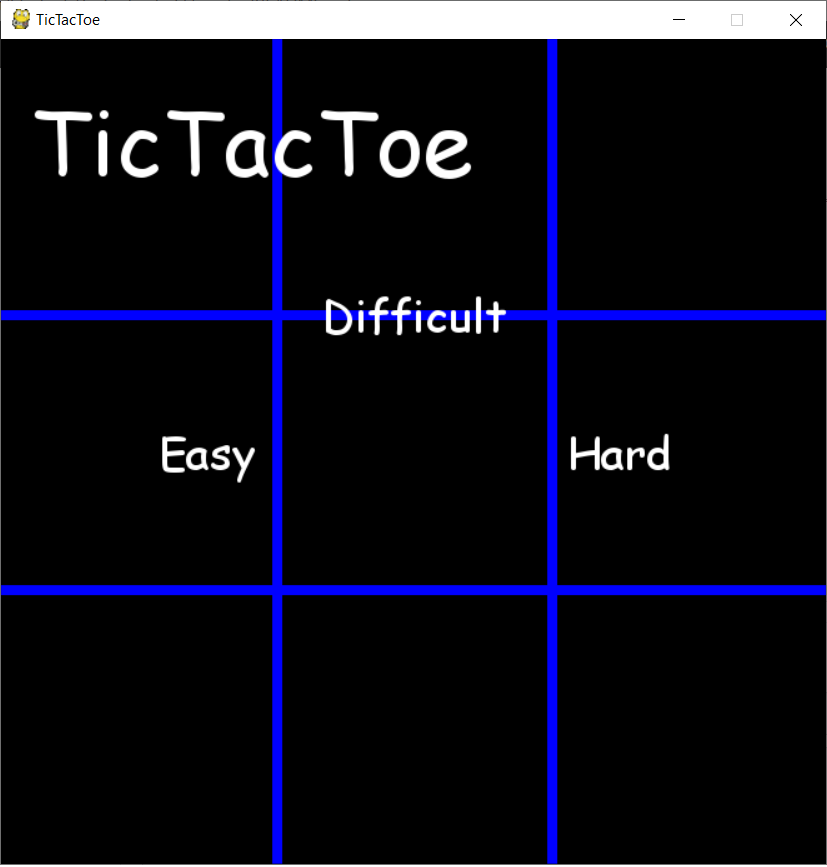
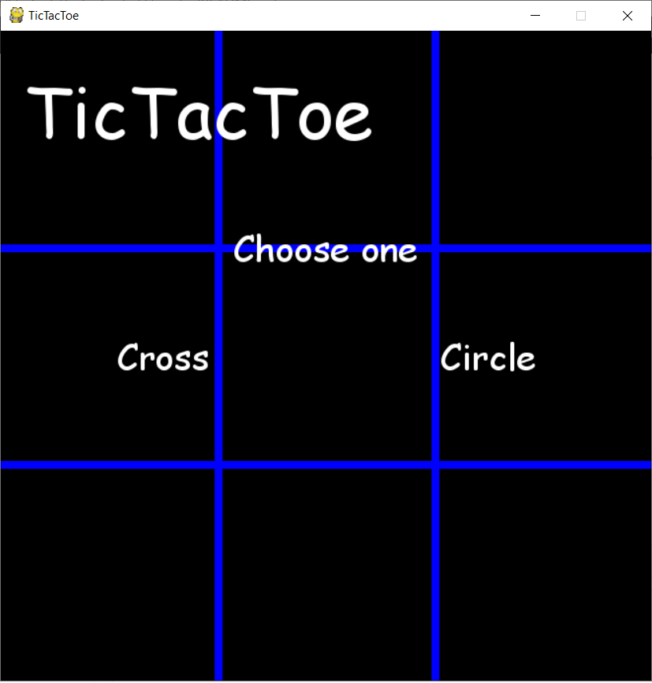
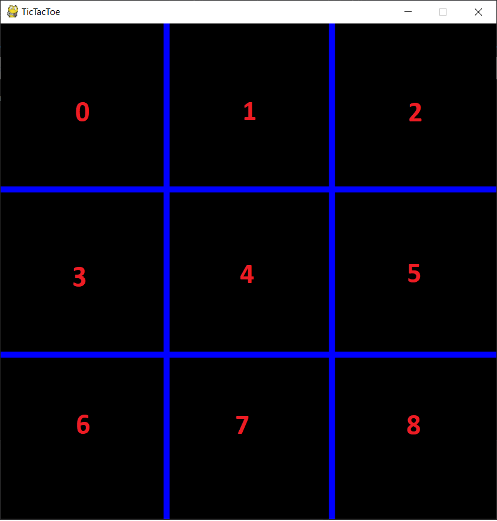

# TicTacToe
TicTacToe alebo piškvorky je klasická hra pre dvoch hráčov. V tejto variante si hráč môže vybrať, či chce hrať proti druhému hráčovi alebo proti počítaču. Taktiež je možnosť simulovať hru počítaču proti samému sebe.
Úroveň počítaču sa dá zvoliť z dvoch možností - optimálny súper, slabý súper.

## Cieľ
Cieľom tohto zápočtového programu je vytvorenie funkčnej hry TicTacToe.

## Požiadavky
- Pygame - grafické zobrazenie a beh samotnej hry
- Random - náhodné určovanie ťahov a poradia hráčov
- Time - využitie funkcie sleep

## Ovládanie 
Pomocou myšky

## Použitie
Pre hru spustite [Main.py](Main.py)
Otvorí sa okno programu s hlavným menu.



Po kliknutí na play dostanete na výber na výber z troch možností:
- AI vs AI: hra dvoch počítačov
- Human vs AI: hra užívateľa proti počítaču
- Human vs Human: hra dvoch užívateľov

Hru je možné kedykoľvek ukončiť kliknutím na krížik v pravom hornom rohu okna.

### AIvsAI
Nasimuluje hru dvoch rôznych obtiažností.
Počítač s ľahkou obtiažnosťou vyberá svoje ťahy náhodne. Tento ťah určuje funkcia turn. Táto funkcia vráti pozíciu na hracej ploche, na ktorú uskutoční svoj ťah.

Počítač s náročnou obtiažnosťou sa snaží nájsť najvhodnejší ťah.
Na tento ťah využíva počítač dve funkcie win_condition a best_choice.

Win_condition kontroluje či existuje vyherný ťah či už pre daný počítač alebo pre súpera. Ak takýto ťah neexistuje tak funkcia vráti hodnotu -1, inak vráti pozíciu na hracej ploche

Best_choice sa spúšťa len v prípade ak funkcia win_condition vráti hodnotu -1. Táto funkcia vyberá vhodný ťah z voľných políčok. 
Prvé dve podmienky určujú, aký ťah má počítač zahrať pri špecifických situáciach. Zvyšok funkcie vyberá náhodné políčko na základe priradenia hodnôt jednotlivým políčkam. Pozície 0,2,6,8 majú najvyššiu hodnotu následne pozícia 4 a  najhoršie ťahy sú 1,3,5,7.

### HumanVsAI
Po kliknutí na Human vs AI sa zobrazia dve obtiažnosti. Tieto náročnosti som vysvetlil v časti [AI vs AI](#AIvsAI)



Následne sa zobrazí okno s možnosťou výberu či chce hráč hrať za krúžok alebo krížik.



Užívateľ určuje svoj ťah pomocou myšky.

### HumanVsHuman
Po kliknutí sa spustí hra pre dvoch užívateľov. Player 1 je krúžok a Player 2 je krížik.

## Zvyšné funkcie
### win(screen, who, player1 = None, player2 = None)
Táto funkcia skontroluje či niekto vyhral a vypíše víťaza. Celá funkcia funguje na vyhodnocovaní podmienok.  
Parametre:
- screen: zoberie hraciu dosku
- who: hodnota, ktorá určuje aká z troch hier prebieha (0 predstavuje [AI vs AI](#AIvsAI), 1 predstavuje [Human vs AI](#HumanVsAI), 2 predstavuje [Human vs Human](#HumanVsHuman))
-player1 a player2: určuje kto je na ťahu a tým určí víťaza

### draw(screen)
Parameter screen predstavuje zoznam hodnôt, ktorého jednotlivé hodnoty predstavujú jednotlivé pozície na hracej doske. 1 predstavuje krúžok a 2 predstavuje krížik. Ak screen neobsahuje 0 a funkcia win vráti False uskutoční sa táto funkcia

### def menu()
Nakreslí úvodné menu

### def text_objects(text, font), def button(text,font, width, height)
Tieto funkcie fungujú na uľahčenie vykresľovania tlačítok


### display_message(text,font,screen)
Funkcia ktorá slúži na výpis textu.  
Parametre:
- text: text, ktorý bude vypísaný
- font: typ fontu, ktorý bude použitý
- screen: zoberie list s hodnotami, ktoré už boli zahrané

### display_player(display,player,screen,against)
Vypíše kto je na ťahu.  
Parametre:
- display, against: boolean hodnoty, pomocné parametre pri raidení funkcie
- player: určuje kto je na ťahu
- screen: zoberie list s hodnotami, ktoré už boli zahrané

### circle(x,y,color)
Funkcia, ktorá vykresľuje krúžok.  
Parametre:
- x: predstavuje x-ovú súradnicu kruhu
- y: predstavuje y-ovú súradnicu kruhu
- color: predstavuje farbu kruhu

### cross(sx1,sy1,ex1,ey1,sx2,sy2,ex2,ey2,color)
Funkcia na nakreslenie krížiku. Pozostáva z dvoch čiar.   
Parametre:
- sx1: x-ová súradnica začiatku prvej čiary
- sy1: y-ová súradnica začiatku prvej čiary
- ex1: x-ová súradnica konca prvej čiary
- ey1: y-ová súradnica konca prvej čiary
- sx2: x-ová súradnica začiatku druhej čiary
- sy2: y-ová súradnica začiatku druhej čiary
- ex2: x-ová súradnica konca druhej čiary
- ey2: y-ová súradnica konca druhej čiary
- color: farba krížika

### desk()
Nakreslí prázdnu hraciu dosku

### draw_screen(screen)
Nakreslí hraciu dosku s aj zahratými ťahmi

### who_goes_first()
Funkcia na náhodné určenie hráča, ktorý bude mať prvý ťah

## game_loop(run)
Ide o hlavnú funkciu, ktorá riadi celú hru. Parameter run služi na určenie či hra skončila alebo stále beží. Tento cyklus je rozdelený na ďalšie cykly podľa názvu, v ktorom štádiu sa hra nachádza.  
Ide o boolean premenné: 
- title: riadi úvod hry
- setting: riadi časť menu s výberom možností hier
- gameAIvAI: riadi hru dvoch počítačov
- gameHumanvHuman: riadi hru medzi dvoma užívateľmi
- difficulty: riadi menu pre výber obtiažnosti
- XO:riadi menu pre výber 
- gameeasy: riadi hru užívateľa proti počitaču na ľahkej úrovni       
- gamehard: riadi hru uživateľa proti počítaču na náročnej úrovni
        
Ďalšie tri premenné sú display, ktorá je len ako pomocná premenná pre niektoré funkcie ako napríklad [display_player](#display_player(display,player,screen,against)), player, ktorá určí kto je na ťahu a screen, ktorá predstavuje hraciu dosku. Ide o zoznam s hodnotami 0 1 alebo 2.
0 predstavuje práznde políčko, 1 predstavuje krúžok a 2 predstavuje krížik. Jednotlivé pozície v zozname predstavujú pozície na hracej doske ako idú zasebou z ľavého horného rohu postupne k pravému dolnému rohu:



Každá z riadiacich premien riadi jeden cyklus a jednu podmienku.
Napríklad premenná settings:
- podmienka if vytvorí tlačítka na výber hry:

```
if settings == True: # vyber kto hra s kym
            window.fill(black)
            desk()
            button('TicTacToe',bigfont,200,80)
            AIvAIw, AIvAIh = button('AI vs AI',smallfont, window_width//4,window_height//4)            
            HumanvAIw, HumanvAIh = button('Human vs AI',smallfont, 2*window_width//4,2*window_height//4)            
            HumanvHumanw, HumanvHumanh = button('Human vs Human',smallfont, 3*window_width//4,3*window_height//4)
```
- cyklus následne kontroluje či bolo na dané tlačítka kliknuté

```
while settings == True:
            for event in pygame.event.get():
                if event.type == pygame.QUIT:
                    settings= False
                    run = False
                if pygame.mouse.get_pressed() == (1,0,0):
                    x,y = pygame.mouse.get_pos()
                    if x >= (window_width//4)-(AIvAIw//2) and x <= (window_width//4)+(AIvAIw//2) and y >= (window_height//4) - (AIvAIh//2)  and y<= (window_height//4)+(AIvAIh//2):
                        gameAIvAI = True
                        settings = False
                    if x >= (2*window_width//4)-(HumanvAIw//2) and x <= (2*window_width//4)+(HumanvAIw//2) and y >= (2*window_height//4) - (HumanvAIh//2)  and y<= (2*window_height//4)+(HumanvAIh//2):
                        difficulty = True
                        settings = False
                    if x >= (3*window_width//4)-(HumanvHumanw//2) and x <= (3*window_width//4)+(HumanvHumanw//2) and y >= (3*window_height//4) - (HumanvHumanh//2)  and y<= (3*window_height//4)+(HumanvHumanh//2):
                        gameHumanvHuman = True
                        settings = False
```
Vždy sa v cykle nachádza podmienka, ktorá spôsobuje ukončenie tohoto cyklu. V mojom prípade je to zmenou riadiacej premennej na False a zmenením inej riadiacej premennej na True, čo spôsobí pokračovanie programu.
Na tomto princípe fungujú všetky riadiace premenné.
